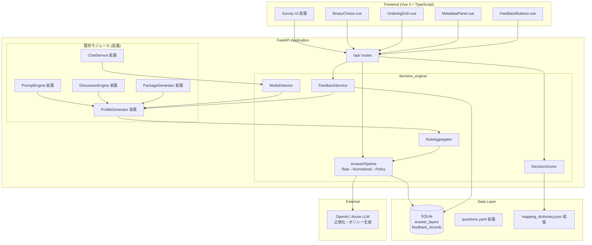

# Design Document: Agent Decision Engine

## Overview

Agent Decision Engine は、既存の Agent Profiler / Agent Evolution システムに「意思決定エンジン」を追加し、**全質問（既存53問 + 新規35問 = 88問）に統一3層パイプライン（Raw → Normalized → Policy）を適用する**拡張モジュールです。回答を「性格ラベル」ではなく「安定した行動仕様（Policy Rule）」に変換し、Rule Hierarchy として集約することで、エージェントの再現性を最大化します。4軸スコアは base_os 生成の補助指標として残存し、主要な行動規範は Rule Hierarchy が担います。

### 設計判断の要旨

| 判断項目 | 決定 | 理由 |
|---------|------|------|
| モジュール配置 | `backend/app/decision_engine/` | evolution と独立に開発・テスト可能 |
| パイプライン適用範囲 | **全質問（既存+新規88問）** | 部分適用だと既存回答がルール化されず再現性が低下する |
| スコアリング方式 | Mapping Dictionary 拡張（axes + policy_text + normalized_tags） | 既存4軸スコアを壊さず並行動作 |
| 3層パイプライン | Raw→Normalized→Policy | 生データ保存＋LLM正規化＋実行可能ルール生成 |
| 4軸スコアの位置づけ | 補助指標（base_os生成用） | Rule Hierarchyが主要行動規範を担う |
| フィードバック閾値 | 10件reject蓄積で±0.1調整 | 急激な変更防止＋統計的有意性 |
| 後方互換性 | **なし（再回答前提）** | 全質問にpolicy_text追加のため既存セッション無効 |
| PBTライブラリ | Hypothesis (既存利用中) | プロジェクト既存インフラ活用 |

## Architecture



## Components and Interfaces

### モジュール構造

```
backend/app/decision_engine/
├── __init__.py
├── config.py               # Decision Engine 固有設定
├── models.py               # Pydantic データモデル
├── scorer.py               # スコアリング・重み計算エンジン
├── answer_pipeline.py      # 3層パイプライン (Raw→Normalized→Policy)
├── rule_aggregator.py      # Rule Hierarchy 集約ロジック
├── feedback_service.py     # フィードバック記録・重み調整
├── mode_detector.py        # コンテキスト適応モード検出
├── normalizer_llm.py       # LLM ベース正規化クライアント
├── routes.py               # Decision Engine 固有 API ルーター
└── dependencies.py         # DI コンテナ

frontend/src/components/decision/
├── BinaryChoice.vue        # トレードオフ2択 UI
├── OrderingDnD.vue         # ドラッグ&ドロップ順序付け UI
├── MetadataPanel.vue       # 回答メタデータパネル
├── FeedbackButtons.vue     # フィードバック3ボタン UI
└── composables/
    ├── useDecisionSurvey.ts  # Decision Engine 質問 API
    └── useFeedback.ts        # フィードバック API クライアント
```

### 1. Configuration (config.py)

```python
from pydantic_settings import BaseSettings
from pydantic import Field


class DecisionEngineSettings(BaseSettings):
  """Decision Engine システム設定

  環境変数 DECISION_ プレフィクスで名前空間を分離。
  """

  # フィードバック
  feedback_threshold: int = Field(default=10, ge=1)
  weight_adjustment_step: float = Field(default=0.1, ge=0.01, le=0.5)
  max_core_invariants: int = Field(default=10, ge=1, le=50)

  # LLM 正規化
  normalization_model: str = "gpt-4.1-mini"
  normalization_max_tokens: int = Field(default=500, ge=100)

  # プロンプト制限
  max_prompt_tokens: int = Field(default=4000, ge=100)

  # 確信度マッピング (1-5 スケール → 0.0-1.0)
  confidence_mapping: dict[int, float] = {
    1: 0.2, 2: 0.4, 3: 0.6, 4: 0.8, 5: 1.0,
  }

  model_config = {"env_prefix": "DECISION_", "env_file": ".env"}
```

### 2. Decision Scorer (scorer.py)

```python
from app.models.scores import AxisScores
from app.services.data_loader import MappingDictionaryLoader


class MappingNotFoundError(Exception):
  """マッピング辞書にエントリが存在しない場合"""
  pass


class DecisionScorer:
  """意思決定スコアリングエンジン

  Mapping Dictionary を参照し、各質問カテゴリの回答から
  Priority_Weight / Tradeoff_Tendency を計算する。
  既存 ScoringEngine と同パターンだが、出力が4軸ではなく
  優先度重み・トレードオフスコアである点が異なる。
  """

  def __init__(self, mapping_loader: MappingDictionaryLoader):
    self._mappings = mapping_loader

  def score_decision_model(
    self, question_id: str, choice_id: str
  ) -> dict[str, int]:
    """decision_model 回答のスコアを算出する

    Returns:
      priority_label → weight_increment のマッピング

    Raises:
      MappingNotFoundError: question_id + choice_id の組み合わせが辞書にない場合
    """
    ...

  def score_tradeoff(
    self, question_id: str, choice_id: str
  ) -> tuple[str, float]:
    """tradeoff_scenarios 回答のスコアを算出する

    Returns:
      (conflict_pair_name, tendency_score)

    Raises:
      MappingNotFoundError: マッピングが存在しない場合
    """
    ...

  def score_failure_pattern(
    self, question_id: str, choice_id: str
  ) -> tuple[str, str]:
    """failure_patterns 回答を分類する

    Returns:
      (subcategory, label_string)

    Raises:
      MappingNotFoundError: マッピングが存在しない場合
    """
    ...

  def score_context_adaptation(
    self, question_id: str, choice_id: str
  ) -> dict[str, dict[str, str]]:
    """context_adaptation 回答からモード設定を導出する

    Returns:
      {mode_name: {tone, detail, focus}}

    Raises:
      MappingNotFoundError: マッピングが存在しない場合
    """
    ...

  def normalize_weights(
    self, accumulated: dict[str, int]
  ) -> dict[str, float]:
    """累積重みを 0.0〜1.0 に正規化する

    formula: (value - min) / (max - min), 小数点2桁
    少なくとも1つのエントリが 1.0 になることを保証する。
    """
    if not accumulated:
      return {}
    min_val = min(accumulated.values())
    max_val = max(accumulated.values())
    if max_val == min_val:
      return {k: 1.0 for k in accumulated}
    return {
      k: round((v - min_val) / (max_val - min_val), 2)
      for k, v in accumulated.items()
    }
```

### 3. Answer Pipeline (answer_pipeline.py)

```python
from dataclasses import dataclass
from datetime import datetime, timezone

import aiosqlite

from app.decision_engine.normalizer_llm import LLMNormalizer


@dataclass
class RawLayer:
  """生データ層: ユーザー回答のオリジナル"""
  question_id: str
  choice_id: str | None
  choice_label: str | None
  free_text: str | None


@dataclass
class NormalizedLayer:
  """正規化層: LLM による構造化タグ"""
  tags: list[dict[str, str]]  # [{type: "value_tag"|"behavior_tag"|..., value: str}]


@dataclass
class PolicyLayer:
  """ポリシー層: エージェント実行可能ルール"""
  rule: str  # "when_{condition}: {action}" 形式


@dataclass
class ThreeLayerAnswer:
  """3層構造化回答"""
  raw: RawLayer
  normalized: NormalizedLayer | None
  policy: PolicyLayer | None
  is_pending: bool = False


class AnswerPipeline:
  """回答3層構造化パイプライン

  1. Raw: 元回答をそのまま保存
  2. Normalized: LLM で正規化タグを抽出
  3. Policy: 正規化結果から "when_X: Y" ルールを生成

  定義済み選択肢 → Mapping Dictionary からルール直接導出
  自由記述 → LLM による正規化 → ルール生成
  """

  def __init__(self, db_path: str, llm_normalizer: LLMNormalizer):
    self._db_path = db_path
    self._normalizer = llm_normalizer

  async def init_db(self) -> None:
    """answer_layers テーブルを初期化する"""
    async with aiosqlite.connect(self._db_path) as db:
      await db.execute("""
        CREATE TABLE IF NOT EXISTS answer_layers (
          id INTEGER PRIMARY KEY AUTOINCREMENT,
          session_id TEXT NOT NULL,
          question_id TEXT NOT NULL,
          raw_json TEXT NOT NULL,
          normalized_json TEXT,
          policy_text TEXT,
          normalization_tags TEXT,
          permanence TEXT NOT NULL DEFAULT 'permanent',
          confidence REAL NOT NULL DEFAULT 0.6,
          exception_note TEXT,
          is_core_rule INTEGER NOT NULL DEFAULT 0,
          ambiguity REAL NOT NULL DEFAULT 0.0,
          created_at TEXT NOT NULL,
          updated_at TEXT NOT NULL
        )
      """)
      await db.execute("""
        CREATE INDEX IF NOT EXISTS idx_answer_layers_session
        ON answer_layers(session_id, question_id)
      """)
      await db.commit()

  async def process_predefined(
    self,
    session_id: str,
    question_id: str,
    choice_id: str,
    choice_label: str,
    policy_text: str,
    metadata: "AnswerMetadata | None" = None,
  ) -> ThreeLayerAnswer:
    """定義済み選択肢の3層変換を実行・保存する

    Mapping Dictionary から直接ポリシーを導出するため、
    LLM 呼び出しは不要。
    """
    ...

  async def process_free_text(
    self,
    session_id: str,
    question_id: str,
    text: str,
    metadata: "AnswerMetadata | None" = None,
  ) -> ThreeLayerAnswer:
    """自由記述回答の3層変換を実行・保存する

    LLM 正規化を試行し、失敗時は pending_normalization としてマーク。
    """
    ...

  async def re_normalize_pending(self, session_id: str) -> int:
    """pending_normalization エントリを再処理する

    Returns:
      再処理成功件数
    """
    ...

  async def get_all_policies(self, session_id: str) -> list[dict]:
    """セッションの全ポリシーを質問順序で取得する"""
    ...
```

### 4. LLM Normalizer (normalizer_llm.py)

```python
from dataclasses import dataclass

from app.services.llm_client import LLMClient


@dataclass
class NormalizationResult:
  """LLM 正規化結果"""
  tags: list[dict[str, str]]  # [{type, value}]
  policy_text: str  # "when_X: Y" 形式


class LLMNormalizer:
  """LLM ベース正規化クライアント

  自由記述テキストから以下を抽出する:
  - value_tag: 価値観
  - behavior_tag: 行動パターン
  - prohibition_tag: 禁止事項
  - condition_tag: 条件・例外

  抽出結果からエージェント実行可能ポリシーを生成する。
  """

  VALID_TAG_TYPES = ("value_tag", "behavior_tag", "prohibition_tag", "condition_tag")

  def __init__(self, llm_client: LLMClient, model: str = "gpt-4.1-mini"):
    self._llm = llm_client
    self._model = model

  async def normalize(
    self, question_text: str, answer_text: str
  ) -> NormalizationResult | None:
    """自由記述テキストを正規化する

    Returns:
      NormalizationResult or None (LLM 呼び出し失敗時)
    """
    ...

  def _build_prompt(self, question_text: str, answer_text: str) -> str:
    """正規化用システムプロンプトを構築する"""
    ...

  def _parse_response(self, response: str) -> NormalizationResult | None:
    """LLM レスポンスを構造化データにパースする"""
    ...
```

### 5. Rule Aggregator (rule_aggregator.py)

```python
from dataclasses import dataclass


@dataclass
class RuleHierarchy:
  """ルール優先順位体系

  core_invariants: is_core_rule=True AND confidence>=0.8
  context_rules: confidence>=0.5 AND is_core_rule=False
  exceptions: condition_tag を含むルール
  preferences: その他のルール
  """
  core_invariants: list[dict]  # [{topic, rule, confidence, is_core}]
  context_rules: list[dict]
  exceptions: list[dict]
  preferences: list[dict]


class RuleAggregator:
  """ポリシールールの優先順位集約

  AnswerPipeline から全ポリシーを取得し、
  confidence / is_core_rule / normalization_tags を基に
  4層ヒエラルキーに分類する。
  """

  MAX_CORE_INVARIANTS = 10

  def aggregate(
    self, policies: list[dict], max_core: int = 10
  ) -> RuleHierarchy:
    """全ポリシーを Rule Hierarchy に集約する

    Args:
      policies: answer_pipeline.get_all_policies() の出力
      max_core: core_invariants の最大数

    Returns:
      分類済み RuleHierarchy
    """
    ...

  def _classify_rule(self, policy: dict) -> str:
    """単一ルールの分類先を決定する

    Returns:
      "core_invariants" | "context_rules" | "exceptions" | "preferences"
    """
    ...
```

### 6. Feedback Service (feedback_service.py)

```python
import logging
from datetime import datetime, timezone

import aiosqlite

logger = logging.getLogger(__name__)


class FeedbackService:
  """フィードバック記録・重み調整サービス

  ユーザーがエージェント回答を評価し、10件以上の reject が
  特定次元に蓄積した場合に自動重み調整を実行する。

  重み調整アルゴリズム:
  1. reject の user_correction テキストからキーワードを抽出
  2. priority / tradeoff 次元とのマッチングを実行
  3. マッチした次元の重みを ±0.1 調整（方向は修正パターンから推定）
  4. 結果を 0.0〜1.0 にクランプ
  5. modification_history に記録
  """

  def __init__(
    self, db_path: str, threshold: int = 10, step: float = 0.1
  ):
    self._db_path = db_path
    self._threshold = threshold
    self._step = step

  async def init_db(self) -> None:
    """feedback_records テーブルを初期化する"""
    async with aiosqlite.connect(self._db_path) as db:
      await db.execute("""
        CREATE TABLE IF NOT EXISTS feedback_records (
          id INTEGER PRIMARY KEY AUTOINCREMENT,
          agent_id TEXT NOT NULL,
          thread_id TEXT NOT NULL,
          turn_id TEXT NOT NULL,
          feedback_type TEXT NOT NULL CHECK(feedback_type IN ('approve', 'reject')),
          user_correction TEXT,
          original_response TEXT NOT NULL,
          created_at TEXT NOT NULL
        )
      """)
      await db.execute("""
        CREATE INDEX IF NOT EXISTS idx_feedback_agent_date
        ON feedback_records(agent_id, created_at)
      """)
      await db.execute("""
        CREATE INDEX IF NOT EXISTS idx_feedback_agent_type
        ON feedback_records(agent_id, feedback_type)
      """)
      await db.commit()

  async def record_feedback(
    self,
    agent_id: str,
    thread_id: str,
    turn_id: str,
    feedback_type: str,
    user_correction: str | None,
    original_response: str,
  ) -> dict:
    """フィードバックを記録する

    Returns:
      {feedback_id: int, created_at: str}

    Raises:
      ValueError: feedback_type が "reject" で user_correction が空の場合
    """
    ...

  async def check_and_adjust(self, agent_id: str) -> list[dict]:
    """蓄積フィードバックを分析し、重み調整を実行する

    Returns:
      実行された調整のリスト [{field_name, previous_value, new_value, ...}]
    """
    ...

  async def get_modification_history(
    self, profile_id: str
  ) -> list[dict]:
    """プロファイルの変更履歴を時系列順で取得する"""
    ...

  def _extract_dimension_keywords(
    self, corrections: list[str]
  ) -> dict[str, int]:
    """修正テキスト群から次元キーワードの出現頻度を集計する"""
    ...

  def _adjust_weight(
    self, current: float, direction: str, step: float
  ) -> float:
    """重みを調整し 0.0〜1.0 にクランプする"""
    adjusted = current + step if direction == "increase" else current - step
    return round(max(0.0, min(1.0, adjusted)), 2)
```

### 7. Mode Detector (mode_detector.py)

```python
class ModeDetector:
  """コンテキスト適応モード検出エンジン

  ユーザーメッセージと直近会話履歴から、
  context_adaptation の switch_triggers 条件と照合し、
  適用すべき Adaptation_Mode を判定する。
  """

  # 緊急モード解除に必要な連続非緊急メッセージ数
  EMERGENCY_EXIT_THRESHOLD = 3

  def __init__(self, context_adaptation: dict | None = None):
    self._modes = context_adaptation.get("modes", {}) if context_adaptation else {}
    self._triggers = context_adaptation.get("switch_triggers", {}) if context_adaptation else {}
    self._emergency_counter = 0

  def detect_mode(
    self, message: str, recent_turns: list[dict]
  ) -> str | None:
    """メッセージと直近5ターンからモードを判定する

    Returns:
      mode_name or None (該当モードなし)
    """
    ...

  def get_mode_config(self, mode_name: str) -> dict[str, str]:
    """モード名から設定(tone, detail, focus)を取得する"""
    return self._modes.get(mode_name, {})

  def format_mode_prompt(self, mode_name: str) -> str:
    """モード設定をシステムプロンプト追記形式に整形する

    出力形式:
    ## Current Mode: {mode_name}
    - Tone: {tone}
    - Detail: {detail}
    - Focus: {focus}
    """
    ...

  def _check_urgency_triggers(self, text: str) -> bool:
    """緊急性トリガーの検出"""
    ...

  def _check_audience_triggers(self, text: str) -> str | None:
    """聴衆依存トリガーの検出 → mode_name"""
    ...

  def _check_mental_state_triggers(
    self, text: str, recent_turns: list[dict]
  ) -> str | None:
    """認知状態トリガーの検出 → mode_name"""
    ...
```

### 8. REST API Routes (routes.py)

```python
from fastapi import APIRouter, Depends, HTTPException

decision_router = APIRouter(prefix="/api")


# POST /api/feedback
#   → フィードバック記録 (201)

# GET /api/feedback/{agent_id}
#   → フィードバック一覧 (limit/offset)

# GET /api/profiles/{profile_id}/modification-history
#   → 変更履歴

# GET /api/profiles/{profile_id}/decision-engine
#   → decision_model + failure_patterns + context_adaptation + reasoning_flow

# POST /api/sessions/{id}/re-normalize
#   → pending_normalization の再処理
```

### 9. ProfileGenerator 拡張

既存 `backend/app/core/profile_generator.py` に以下を追加:

```python
class ProfileGenerator:
  """拡張: 全質問統一3層パイプライン + Decision Engine セクション生成

  generate() メソッドを拡張し:
  1. 全回答（既存+新規88問）から answer_layers テーブルのポリシーを集約
  2. RuleAggregator で4層ヒエラルキーに分類
  3. decision engine カテゴリ完了時は対応セクションも追加
  4. 4軸スコア由来の base_os は従来通り生成（補助指標として保持）
  """

  def _build_decision_rules(
    self, session_id: str, pipeline: "AnswerPipeline"
  ) -> list[dict]:
    """全質問のポリシールールを収集する（既存+新規）

    Returns:
      [{topic, rule, confidence, is_core}, ...] ordered by question sequence
    """
    ...

  def _build_rule_hierarchy(
    self, decision_rules: list[dict], aggregator: "RuleAggregator"
  ) -> dict:
    """全ルールを4層ヒエラルキーに集約する

    Returns:
      {core_invariants: [...], context_rules: [...], exceptions: [...], preferences: [...]}
    """
    ...

  def _build_decision_model(
    self, answers: list["Answer"], scorer: "DecisionScorer"
  ) -> dict | None:
    """decision_model + tradeoff_tendencies を構築する

    Returns:
      None (未完了時) or {priorities, priority_weights, escalation_rules,
      auto_approve_scope, tradeoff_tendencies}
    """
    ...

  def _build_failure_patterns(
    self, answers: list["Answer"], scorer: "DecisionScorer"
  ) -> dict | None:
    """failure_patterns を構築する

    Returns:
      None or {degradation_triggers, procrastination_patterns,
      overconfidence_conditions, recurring_mistakes}
    """
    ...

  def _build_context_adaptation(
    self, answers: list["Answer"], scorer: "DecisionScorer"
  ) -> dict | None:
    """context_adaptation を構築する

    Returns:
      None or {modes: {name: {tone, detail, focus}}, switch_triggers: {...}}
    """
    ...

  def _build_reasoning_flow(
    self, answers: list["Answer"]
  ) -> dict | None:
    """reasoning_flow を構築する

    Returns:
      None or {default_steps: [...], verification_method, learning_style}
    """
    ...

  def _build_rule_hierarchy(
    self, session_id: str, aggregator: "RuleAggregator"
  ) -> dict | None:
    """rule_hierarchy を構築する"""
    ...

  def _build_answer_metadata_summary(
    self, session_id: str
  ) -> dict | None:
    """answer_metadata_summary を構築する"""
    ...
```

### 10. PromptEngine テンプレート拡張

既存 `backend/app/evolution/prompt_engine.py` の Jinja2 テンプレートに以下セクションを追加:

```jinja2

## Decision Framework

- {{ priority.name }} (weight: {{ priority.weight }})




## Known Weaknesses & Guardrails

⚠️ {{ trigger }}


🔄 {{ mistake }}




## Context Adaptation Rules

### {{ mode_name }}
- Tone: {{ config.tone }}
- Detail: {{ config.detail }}
- Focus: {{ config.focus }}

Switch Conditions:

- {{ category }}: {{ conditions | join(", ") }}




## Default Reasoning Process

{{ loop.index }}. {{ step }}

- Verification: {{ reasoning_flow.verification_method }}
- Learning Style: {{ reasoning_flow.learning_style }}

```

プロンプト組み立ての優先順位（上が最優先、トークン制限超過時は下から削除）:
1. Rule Hierarchy の core_invariants（絶対保持）
2. decision_model (priorities + tradeoff_tendencies)
3. failure_patterns (guardrails)
4. base_os (4軸由来の personality description — 補助)
5. context_adaptation (モード切替条件)
6. reasoning_flow（最初に削除対象）

### 11. ChatService 拡張

既存 `backend/app/evolution/chat.py` に ModeDetector を統合:

```python
class ChatService:
  """拡張: コンテキスト適応モード検出

  send_message 実行前に ModeDetector でモード判定し、
  該当モードがあればシステムプロンプトに追記する。
  failure_patterns は search_memory ツールのインデックスに追加する。
  """

  def __init__(
    self,
    # ... 既存パラメータ ...
    mode_detector: "ModeDetector | None" = None,
  ):
    self._mode_detector = mode_detector

  async def _detect_and_apply_mode(
    self, agent_id: str, message: str, system_prompt: str
  ) -> str:
    """モード検出 → プロンプト追記

    context_adaptation が無い場合はスキップ（性能ペナルティなし）。
    """
    ...

  async def _index_failure_patterns(
    self, profile: "ProfileOutput"
  ) -> None:
    """failure_patterns を search_memory 用にインデックスする

    degradation_triggers と recurring_mistakes を
    semantic_contexts として登録し、検索可能にする。
    """
    ...
```

### 12. DiscussionEngine 拡張

既存 `backend/app/evolution/discussion_engine.py` に decision model 注入:

```python
class DiscussionEngine:
  """拡張: 意思決定モデルの議論反映

  各エージェントのターン生成時に:
  1. decision_model.priorities を "## My Decision Priorities" として注入
  2. reasoning_flow.default_steps を "## My Reasoning Approach" として注入
  3. tradeoff_tendencies の差が 0.4 以上の次元で立場維持指示を付与
  """

  def _build_decision_prompt_section(
    self, profile: "ProfileOutput"
  ) -> str:
    """decision_model セクションをプロンプト文字列に変換する"""
    ...

  def _build_conflict_directives(
    self, agent_profile: "ProfileOutput", other_profiles: list["ProfileOutput"]
  ) -> list[str]:
    """対立する tradeoff 次元に対する立場維持指示を生成する

    差 >= 0.4 の次元に対して:
    "Maintain your position on {dimension}: your tendency is {score}"
    """
    ...
```

### 13. PackageGenerator 拡張

既存 `backend/app/evolution/package_generator.py` に新ファイル生成を追加:

```python
class PackageGenerator:
  """拡張: Decision Engine データのパッケージ含有

  ProfileOutput に decision engine データがある場合:
  - system_prompt.md に "## Decision Framework" / "## Self-Awareness" を追加
  - skills/decision-rules/SKILL.md を生成
  - tools/reasoning_flow.json を生成
  - config.json に context_adaptation を追加
  """

  def _generate_decision_rules_skill(
    self, profile: "ProfileOutput"
  ) -> str:
    """skills/decision-rules/SKILL.md の内容を生成する

    YAML frontmatter + Escalation Rules + Auto-Approve Scope + Tradeoff Tendencies
    """
    ...

  def _generate_reasoning_flow_tool(
    self, profile: "ProfileOutput"
  ) -> str:
    """tools/reasoning_flow.json の内容を生成する

    UTF-8, 2-space indent JSON
    """
    ...
```

### 14. Frontend Components

#### TypeScript Interfaces

```typescript
// types/decision.ts

/** 3層回答構造 */
export interface ThreeLayerAnswer {
  raw: { question_id: string; choice_id: string | null; choice_label: string | null; free_text: string | null };
  normalized: { tags: Array<{ type: string; value: string }> } | null;
  policy: { rule: string } | null;
}

/** 回答メタデータ */
export interface AnswerMetadata {
  permanence: 'permanent' | 'contextual';
  confidence: number; // 0.2〜1.0
  exception_note: string | null;
  is_core_rule: boolean;
  ambiguity: number;
}

/** フィードバック送信ペイロード */
export interface FeedbackPayload {
  agent_id: string;
  thread_id: string;
  turn_id: string;
  feedback_type: 'approve' | 'reject';
  user_correction?: string;
}

/** フィードバックレコード */
export interface FeedbackRecord {
  id: number;
  agent_id: string;
  thread_id: string;
  turn_id: string;
  feedback_type: 'approve' | 'reject';
  user_correction: string | null;
  original_response: string;
  created_at: string;
}

/** 変更履歴エントリ */
export interface ModificationHistoryEntry {
  field_name: string;
  previous_value: number;
  new_value: number;
  adjustment_reason: string;
  feedback_count: number;
  timestamp: string;
}

/** Ordering 質問の選択肢 */
export interface OrderingChoice {
  id: string;
  label: string;
}

/** Decision Engine プロファイルセクション */
export interface DecisionEngineData {
  decision_model: {
    priorities: string[];
    priority_weights: Record<string, number>;
    escalation_rules: string[];
    auto_approve_scope: string[];
    tradeoff_tendencies: Record<string, number>;
  } | null;
  failure_patterns: {
    degradation_triggers: string[];
    procrastination_patterns: string[];
    overconfidence_conditions: string[];
    recurring_mistakes: string[];
  } | null;
  context_adaptation: {
    modes: Record<string, { tone: string; detail: string; focus: string }>;
    switch_triggers: Record<string, string[]>;
  } | null;
  reasoning_flow: {
    default_steps: string[];
    verification_method: string;
    learning_style: string;
  } | null;
}
```

#### BinaryChoice.vue

トレードオフ質問用の2択 UI。カード形式で左右に配置し、選択時にハイライト。「Other」オプションなし。

#### OrderingDnD.vue

ドラッグ&ドロップによる順序付け UI。Fisher-Yates シャッフルで初期順序をランダム化。768px以下ではナンバー入力フォールバック。

#### MetadataPanel.vue

回答メタデータの展開可能パネル。permanence トグル、confidence スライダー（★1〜5）、exception_note テキストエリア。

#### FeedbackButtons.vue

エージェント回答下部のフィードバック3ボタン（👍/✏️/⏭️）。reject 選択時にテキストエリア展開。2000文字制限＋カウンター表示。

## Data Models

### Pydantic モデル (backend/app/decision_engine/models.py)

```python
from pydantic import BaseModel, Field
from enum import Enum


class FeedbackType(str, Enum):
  APPROVE = "approve"
  REJECT = "reject"


class Permanence(str, Enum):
  PERMANENT = "permanent"
  CONTEXTUAL = "contextual"


class NormalizationTagType(str, Enum):
  VALUE_TAG = "value_tag"
  BEHAVIOR_TAG = "behavior_tag"
  PROHIBITION_TAG = "prohibition_tag"
  CONDITION_TAG = "condition_tag"


class NormalizationTag(BaseModel):
  """正規化タグ"""
  type: NormalizationTagType
  value: str = Field(max_length=50)


class AnswerMetadata(BaseModel):
  """回答メタデータ"""
  permanence: Permanence = Permanence.PERMANENT
  confidence: float = Field(default=0.6, ge=0.2, le=1.0)
  exception_note: str | None = Field(default=None, max_length=200)
  is_core_rule: bool = False
  ambiguity: float = Field(default=0.0, ge=0.0, le=1.0)


class ThreeLayerAnswerModel(BaseModel):
  """3層回答構造 (API レスポンス用)"""
  raw: dict  # {question_id, choice_id, choice_label} or {question_id, free_text}
  normalized: dict | None = None  # {tags: [{type, value}]}
  policy: str | None = None  # "when_X: Y" 形式


class FeedbackSubmission(BaseModel):
  """フィードバック送信リクエスト"""
  agent_id: str = Field(pattern=r"^[0-9a-f]{8}-[0-9a-f]{4}-4[0-9a-f]{3}-[89ab][0-9a-f]{3}-[0-9a-f]{12}$")
  thread_id: str = Field(pattern=r"^[0-9a-f]{8}-[0-9a-f]{4}-4[0-9a-f]{3}-[89ab][0-9a-f]{3}-[0-9a-f]{12}$")
  turn_id: str = Field(pattern=r"^[0-9a-f]{8}-[0-9a-f]{4}-4[0-9a-f]{3}-[89ab][0-9a-f]{3}-[0-9a-f]{12}$")
  feedback_type: FeedbackType
  user_correction: str | None = Field(default=None, min_length=1, max_length=2000)


class FeedbackResponse(BaseModel):
  """フィードバック送信レスポンス"""
  feedback_id: int
  created_at: str


class FeedbackListResponse(BaseModel):
  """フィードバック一覧レスポンス"""
  items: list[dict]
  total: int
  limit: int
  offset: int


class ModificationHistoryEntry(BaseModel):
  """変更履歴エントリ"""
  field_name: str
  previous_value: float
  new_value: float
  adjustment_reason: str = Field(max_length=200)
  feedback_count: int
  timestamp: str


class DecisionModelOutput(BaseModel):
  """decision_model セクション出力"""
  priorities: list[str] = Field(min_length=1, max_length=10)
  priority_weights: dict[str, float]
  escalation_rules: list[str] = Field(max_length=10)
  auto_approve_scope: list[str] = Field(max_length=10)
  tradeoff_tendencies: dict[str, float]
  pending_other_answers: list[str] = Field(default_factory=list)


class FailurePatternsOutput(BaseModel):
  """failure_patterns セクション出力"""
  degradation_triggers: list[str] = Field(default_factory=list, max_length=10)
  procrastination_patterns: list[str] = Field(default_factory=list, max_length=10)
  overconfidence_conditions: list[str] = Field(default_factory=list, max_length=10)
  recurring_mistakes: list[str] = Field(default_factory=list, max_length=10)


class ContextAdaptationOutput(BaseModel):
  """context_adaptation セクション出力"""
  modes: dict[str, dict[str, str]]  # {mode_name: {tone, detail, focus}}
  switch_triggers: dict[str, list[str]]  # {category: [conditions]}


class ReasoningFlowOutput(BaseModel):
  """reasoning_flow セクション出力"""
  default_steps: list[str] = Field(min_length=4, max_length=6)
  verification_method: str = Field(max_length=100)
  learning_style: str = Field(max_length=100)


class RuleHierarchyOutput(BaseModel):
  """rule_hierarchy セクション出力"""
  core_invariants: list[dict]
  context_rules: list[dict]
  exceptions: list[dict]
  preferences: list[dict]


class AnswerMetadataSummary(BaseModel):
  """answer_metadata_summary セクション出力"""
  total_answers: int
  core_rule_count: int
  contextual_count: int
  average_confidence: float
  high_ambiguity_count: int
```

### ProfileOutput 拡張モデル

既存 `backend/app/models/profile.py` の ProfileOutput に Optional フィールドを追加:

```python
from pydantic import BaseModel, Field


class ProfileOutput(BaseModel):
  """拡張: Decision Engine セクション追加

  既存フィールドはそのまま保持。
  decision engine カテゴリ未完了時は各フィールドが None。
  """
  # 既存フィールド（変更なし）
  profile_id: str = Field(..., pattern=r"^prof_\d{6}$")
  persona: "Persona" = Field(default_factory="Persona")
  communication_tone: "CommunicationTone" = Field(default_factory="CommunicationTone")
  base_os: "BaseOS"
  lexical_tags: list[str] = Field(..., min_length=5, max_length=500)
  semantic_contexts: dict[str, str]
  context_layers: "ContextLayers" = Field(default_factory="ContextLayers")

  # Decision Engine 拡張（Optional — 後方互換性維持）
  decision_model: "DecisionModelOutput | None" = None
  failure_patterns: "FailurePatternsOutput | None" = None
  context_adaptation: "ContextAdaptationOutput | None" = None
  reasoning_flow: "ReasoningFlowOutput | None" = None
  decision_rules: list[dict] | None = None
  rule_hierarchy: "RuleHierarchyOutput | None" = None
  modification_history: list["ModificationHistoryEntry"] | None = None
  answer_metadata_summary: "AnswerMetadataSummary | None" = None
```

### Mapping Dictionary 拡張フォーマット

既存 `mapping_dictionary.json` の **全エントリ**に `policy_text` と `normalized_tags` を追記し、新規カテゴリのエントリを追加:

```json
{
  "metadata": {
    "version": "3.0",
    "pipeline_scope": "all_categories",
    "decision_engine_categories": [
      "decision_model", "tradeoff_scenarios",
      "failure_patterns", "context_adaptation", "reasoning_flow"
    ]
  },
  "mappings": [
    // === 既存エントリ拡張（axes はそのまま残し policy_text + normalized_tags を追記）===
    {
      "question_id": "bos_001",
      "choice_id": "a",
      "axes": {"ei": 5, "sn": -2, "tf": -3, "jp": -2},
      "policy_text": "when_project_crisis: immediately gather the team for collaborative brainstorming",
      "normalized_tags": [{"type": "behavior_tag", "value": "collaborative_crisis_response"}]
    },
    {
      "question_id": "bos_001",
      "choice_id": "c",
      "axes": {"ei": -3, "sn": 5, "tf": 7, "jp": 3},
      "policy_text": "when_project_crisis: collect data and identify root cause before proposing countermeasures",
      "normalized_tags": [{"type": "behavior_tag", "value": "root_cause_analysis"}]
    },
    // ... 全既存エントリに同様に policy_text + normalized_tags を追記 ...

    // === 新規: Decision Model ===
    {
      "question_id": "dm_001",
      "choice_id": "a",
      "target": "decision_model",
      "priority_labels": ["root_cause_first"],
      "weights": {"root_cause_first": 8},
      "policy_text": "when_problem_occurs: investigate root cause before applying fixes",
      "normalized_tags": [{"type": "behavior_tag", "value": "root_cause_first"}]
    },

    // === 新規: Tradeoff ===
    {
      "question_id": "ts_001",
      "choice_id": "a",
      "target": "tradeoff_scenarios",
      "conflict_pair": "speed_vs_quality",
      "tendency_score": 0.2,
      "policy_text": "when_speed_vs_quality_conflict: prioritize speed and iterate later",
      "normalized_tags": [{"type": "value_tag", "value": "speed_priority"}]
    },
    {
      "question_id": "ts_001",
      "choice_id": "b",
      "target": "tradeoff_scenarios",
      "conflict_pair": "speed_vs_quality",
      "tendency_score": 0.8,
      "policy_text": "when_speed_vs_quality_conflict: prioritize quality even if it takes more time",
      "normalized_tags": [{"type": "value_tag", "value": "quality_priority"}]
    },

    // === 新規: Failure Patterns ===
    {
      "question_id": "fp_001",
      "choice_id": "a",
      "target": "failure_patterns",
      "subcategory": "degradation_triggers",
      "label": "sleep_deprivation_performance_drop",
      "policy_text": "when_sleep_deprived: flag decisions as potentially degraded and seek confirmation",
      "normalized_tags": [{"type": "condition_tag", "value": "sleep_deprivation"}]
    },

    // Context Adaptation: mode configuration へのマッピング
    {
      "question_id": "ca_001",
      "choice_id": "a",
      "target": "context_adaptation",
      "mode_name": "executive_report",
      "mode_config": {"tone": "formal", "detail": "minimal", "focus": "results"},
      "trigger_category": "audience",
      "trigger_condition": "reporting to executives or senior leadership"
    }
  ]
}
```

### Database Schema

```sql
-- 回答3層テーブル
CREATE TABLE IF NOT EXISTS answer_layers (
  id INTEGER PRIMARY KEY AUTOINCREMENT,
  session_id TEXT NOT NULL,
  question_id TEXT NOT NULL,
  raw_json TEXT NOT NULL,           -- JSON: {question_id, choice_id, choice_label} or {question_id, free_text}
  normalized_json TEXT,             -- JSON: {tags: [{type, value}]} or null
  policy_text TEXT,                 -- "when_X: Y" or null
  normalization_tags TEXT,          -- JSON array: [{type, value}] or null
  permanence TEXT NOT NULL DEFAULT 'permanent',
  confidence REAL NOT NULL DEFAULT 0.6,
  exception_note TEXT,
  is_core_rule INTEGER NOT NULL DEFAULT 0,
  ambiguity REAL NOT NULL DEFAULT 0.0,
  created_at TEXT NOT NULL,
  updated_at TEXT NOT NULL
);
CREATE INDEX IF NOT EXISTS idx_answer_layers_session ON answer_layers(session_id, question_id);

-- フィードバックテーブル
CREATE TABLE IF NOT EXISTS feedback_records (
  id INTEGER PRIMARY KEY AUTOINCREMENT,
  agent_id TEXT NOT NULL,
  thread_id TEXT NOT NULL,
  turn_id TEXT NOT NULL,
  feedback_type TEXT NOT NULL CHECK(feedback_type IN ('approve', 'reject')),
  user_correction TEXT,
  original_response TEXT NOT NULL,
  created_at TEXT NOT NULL
);
CREATE INDEX IF NOT EXISTS idx_feedback_agent_date ON feedback_records(agent_id, created_at);
CREATE INDEX IF NOT EXISTS idx_feedback_agent_type ON feedback_records(agent_id, feedback_type);
```

## Correctness Properties

*A property is a characteristic or behavior that should hold true across all valid executions of a system—essentially, a formal statement about what the system should do. Properties serve as the bridge between human-readable specifications and machine-verifiable correctness guarantees.*

### Property 1: Priority Weight 正規化の不変条件

*For any* non-empty dictionary of accumulated integer weights, `normalize_weights` の出力は全値が [0.0, 1.0] の範囲内であり、少なくとも1つのエントリが 1.0 に等しく、全値が小数点2桁に丸められていること。

**Validates: Requirements 1.7**

### Property 2: Tradeoff Tendency スコア範囲制約

*For any* valid tradeoff_scenarios の (question_id, choice_id) ペアにおいて、choice "a" は [0.0, 0.3] の範囲のスコアを、choice "b" は [0.7, 1.0] の範囲のスコアを生成すること。

**Validates: Requirements 2.4**

### Property 3: 無効マッピングの一貫した拒否

*For any* decision engine カテゴリの (question_id, choice_id) ペアが Mapping Dictionary に存在しない場合、スコアリング操作は MappingNotFoundError を発生させること。

**Validates: Requirements 1.5, 2.5, 3.5, 4.5, 5.7**

### Property 4: 部分完了時のセクション非生成

*For any* decision engine カテゴリにおいて、そのカテゴリの全質問が回答されていない場合（回答数 < カテゴリ質問数）、該当セクションの出力は None であること。

**Validates: Requirements 1.8, 2.7, 3.7, 4.8, 5.10**

### Property 5: Failure Pattern サブカテゴリ分類の妥当性

*For any* valid failure_patterns の (question_id, choice_id) ペアにおいて、分類結果は4つの定義済みサブカテゴリ (degradation_triggers, procrastination_patterns, overconfidence_conditions, recurring_mistakes) のいずれかに属すること。

**Validates: Requirements 3.4**

### Property 6: Context Adaptation モード設定構造の妥当性

*For any* valid context_adaptation の回答において、導出されるモード設定は tone (≤50文字), detail ("minimal"|"standard"|"comprehensive"), focus (≤50文字) の3フィールドを全て含むこと。

**Validates: Requirements 4.4**

### Property 7: Ordering 回答の順序保存

*For any* valid な step choice_id の順列において、Decision Engine に送信された順序が answer_layers テーブルにそのまま保存されること（index 0 が最高優先度）。

**Validates: Requirements 5.6**

### Property 8: フィードバック記録のラウンドトリップ

*For any* valid なフィードバック送信（agent_id, thread_id, turn_id, feedback_type, user_correction）において、記録後に取得した FeedbackRecord は送信時の全フィールドを変更なく保持していること。

**Validates: Requirements 11.3**

### Property 9: 重み調整のクランプ不変条件

*For any* 現在の重み値 w ∈ [0.0, 1.0] と調整ステップ s = 0.1 において、調整後の値は常に [0.0, 1.0] の範囲内であり、|adjusted - w| ≤ s であること。

**Validates: Requirements 11.5**

### Property 10: 既存プロファイルフィールドの不変性

*For any* 回答セットにおいて、decision engine カテゴリの回答有無に関わらず、ProfileOutput の既存フィールド（profile_id, persona, communication_tone, base_os, lexical_tags, semantic_contexts, context_layers）の値は同一であること。

**Validates: Requirements 12.3**

### Property 11: プロンプトトークン制限遵守

*For any* decision engine セクションを含む ProfileOutput において、PromptEngine が生成するシステムプロンプトのトークン数は max_tokens 設定値を超過しないこと。

**Validates: Requirements 7.6**

### Property 12: Rule Hierarchy 分類の排他性と網羅性

*For any* ポリシールール集合において、各ルールは core_invariants, context_rules, exceptions, preferences のいずれか1つの層にのみ分類され、全ルールがいずれかの層に含まれること（排他的かつ網羅的な分類）。

**Validates: Requirements 16.6**

### Property 13: 確信度による重み乗算の正確性

*For any* base_weight (integer 1〜10) と confidence (float 0.2〜1.0) において、実効的な重み増分は base_weight × confidence に等しいこと。

**Validates: Requirements 17.4**

### Property 14: Core Invariant 候補の分類基準と上限

*For any* 回答集合において、core_invariant に分類される候補は confidence ≥ 0.8 AND permanence = "permanent" の条件を満たすもののみであり、総数は10を超えないこと。超過時は confidence 上位10件が選択されること。

**Validates: Requirements 17.5**

### Property 15: モード検出と switch_trigger の一致性

*For any* メッセージテキストが switch_triggers のいずれかの条件に合致する場合、ModeDetector は対応するモード名を返すこと。合致しない場合は None を返すこと。

**Validates: Requirements 9.1**

### Property 16: Discussion 対立指示の生成条件

*For any* 2エージェントの tradeoff_tendencies において、いずれかの次元の差の絶対値が 0.4 以上の場合、その次元に対する立場維持指示がシステムプロンプトに含まれること。

**Validates: Requirements 10.3**

## Error Handling

### エラー分類と対応方針

| エラー種別 | 発生箇所 | HTTP Status | 対応 |
|-----------|---------|-------------|------|
| MappingNotFoundError | DecisionScorer | 422 | Mapping Dictionary に該当エントリなし。回答を拒否 |
| SessionNotFoundError | Routes | 404 | セッション不存在 |
| ValidationError (Pydantic) | Routes | 422 | リクエストボディ不正 |
| LLM 正規化失敗 | AnswerPipeline | — | pending_normalization としてマーク。再処理可能 |
| フィードバック参照不正 | FeedbackService | 404 | agent_id/thread_id/turn_id が存在しない |
| reject without correction | FeedbackService | 422 | user_correction 必須バリデーション |
| 部分完了状態 | ProfileGenerator | — | 未完了カテゴリのセクションを None にして正常応答 |
| トークン超過 | PromptEngine | — | 優先度低いセクションから truncation |

### LLM 障害時のフォールバック

```python
# normalizer_llm.py 内のフォールバック戦略
async def normalize(self, question_text: str, answer_text: str) -> NormalizationResult | None:
    """LLM 呼び出しに失敗した場合:
    1. リトライ (最大2回, exponential backoff)
    2. 失敗 → None を返し、pending_normalization としてマーク
    3. バッチ再処理エンドポイント POST /api/sessions/{id}/re-normalize で後から処理
    """
    ...
```

### バリデーションルール

- 自由記述テキスト: 最小1文字（非空白）、最大500文字（質問回答）/ 2000文字（フィードバック修正）
- UUID v4 形式: 正規表現パターンでバリデーション
- confidence: 1-5 整数スケール → 0.2-1.0 float への変換は DecisionEngineSettings.confidence_mapping で管理
- policy_text: 最大200文字、"when_" プレフィクスを持つ形式

## Testing Strategy

### テスト方針: デュアルアプローチ

本機能はビジネスロジック（スコアリング・正規化・分類・重み調整）が中心であり、Property-Based Testing (PBT) が非常に有効です。

#### Property-Based Tests (Hypothesis)

- PBT ライブラリ: **Hypothesis** (プロジェクト既存利用中)
- 各テスト最低 **100 iterations**
- 各テストに設計プロパティの参照タグを付与
- タグ形式: `Feature: agent-decision-engine, Property {N}: {title}`

```python
# テスト例: Property 1 — 正規化の不変条件
from hypothesis import given, settings
from hypothesis import strategies as st

@settings(max_examples=200)
@given(
  weights=st.dictionaries(
    keys=st.text(min_size=1, max_size=30),
    values=st.integers(min_value=0, max_value=100),
    min_size=1, max_size=10,
  )
)
def test_normalize_weights_invariants(weights):
  """Feature: agent-decision-engine, Property 1: Priority Weight 正規化の不変条件"""
  result = normalize_weights(weights)
  # 全値が [0.0, 1.0] 範囲内
  assert all(0.0 <= v <= 1.0 for v in result.values())
  # 少なくとも1つが 1.0
  assert max(result.values()) == 1.0
  # 小数点2桁
  assert all(v == round(v, 2) for v in result.values())
```

#### Unit Tests (pytest)

- 具体例によるエッジケース検証
- 統合テスト（API → DB ラウンドトリップ）
- モック利用（LLM 呼び出し部分）

#### テストカバレッジ対応表

| Property # | テストファイル | テスト種別 |
|-----------|-------------|-----------|
| 1 | test_scorer.py | PBT |
| 2 | test_scorer.py | PBT |
| 3 | test_scorer.py | PBT |
| 4 | test_profile_generator.py | PBT |
| 5 | test_scorer.py | PBT |
| 6 | test_scorer.py | PBT |
| 7 | test_answer_pipeline.py | PBT |
| 8 | test_feedback_service.py | PBT |
| 9 | test_feedback_service.py | PBT |
| 10 | test_profile_generator.py | PBT |
| 11 | test_prompt_engine.py | PBT |
| 12 | test_rule_aggregator.py | PBT |
| 13 | test_scorer.py | PBT |
| 14 | test_rule_aggregator.py | PBT |
| 15 | test_mode_detector.py | PBT |
| 16 | test_discussion_engine.py | PBT |

#### 追加 Unit Tests（Example-Based）

- questions.yaml 構造バリデーション (Req 1.1, 2.1, 3.1, 4.1, 5.1)
- Mapping Dictionary エントリ完全性 (Req 13.5)
- API エンドポイント 404/422 レスポンス (Req 14.5, 14.6, 14.7)
- Survey UI 表示ロジック（binary_choice / ordering / metadata panel）
- Backward compatibility: 既存プロファイルでのシステム正常動作 (Req 12.1, 12.6)
- Fisher-Yates シャッフルの一様性検証 (Req 15.2)
