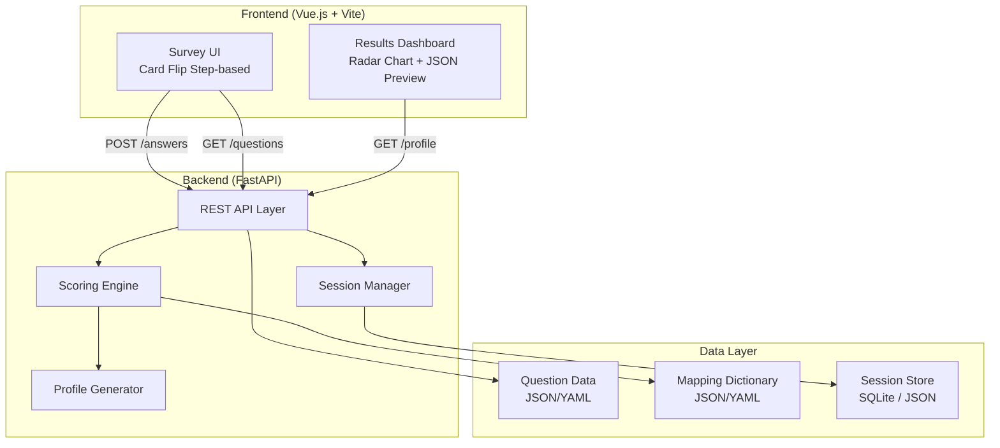
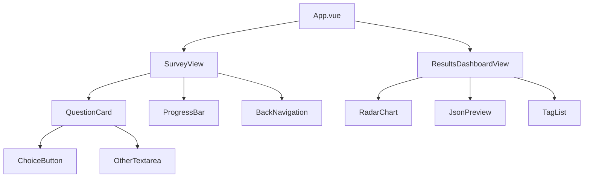

# Design Document: Agent Profiler

## Overview

Agent Profilerは、ユーザーの仕事における価値観・意思決定基準・嗜好を構造化データとして抽出するWebアプリケーションです。フロントエンド（Vue.js）でステップベースのカードフリップ質問UIを提供し、バックエンド（FastAPI）で1問多軸ブレンドスコアリングを実行します。最終出力は3層コンテキストアーキテクチャ（Base OS / Agent Skills / MCP）に分離されたJSON構造であり、ハイブリッド検索（Lexical Tags + Semantic Contexts）を通じてAIエージェントにプログレッシブにロードされます。

### 設計方針

- **シンプルさ優先**: モノリポ構成で、フロントエンドとバックエンドを1リポジトリで管理
- **独立性**: スコアリングロジックはMapping Dictionaryファイルに外部化し、コード変更なしでチューニング可能
- **テスタビリティ**: 純粋関数としてのスコアリング・正規化・プロファイル生成ロジックを分離し、プロパティベーステストで検証
- **拡張性**: 質問の追加・軸の重み調整・出力フォーマット変更がデータファイル編集のみで完結

## Architecture

### システム構成図



### ディレクトリ構成

```
AgentProfiler/
├── frontend/                    # Vue.js SPA
│   ├── src/
│   │   ├── components/          # UI components (QuestionCard, ProgressBar, etc.)
│   │   ├── views/               # SurveyView, ResultsDashboardView
│   │   ├── composables/         # useSession, useSurvey
│   │   ├── stores/              # Pinia stores (session, survey)
│   │   └── types/               # TypeScript type definitions
│   ├── package.json
│   └── vite.config.ts
├── backend/                     # FastAPI application
│   ├── app/
│   │   ├── api/                 # Route handlers
│   │   ├── core/                # Scoring engine, normalizer, profile generator
│   │   ├── models/              # Pydantic models
│   │   ├── services/            # Session manager, data loader
│   │   └── main.py
│   ├── data/                    # Question data + Mapping Dictionary files
│   ├── tests/                   # pytest + Hypothesis property tests
│   └── pyproject.toml
├── docs/                        # Research documentation (Requirement 8)
│   └── psychometric_sources.md
└── README.md
```

### 技術スタック

| レイヤー | 技術 | 理由 |
|---------|------|------|
| Frontend | Vue 3 + TypeScript + Vite | コンポジションAPI、型安全、高速HMR |
| State Management | Pinia | Vue 3公式推奨、TypeScript親和性 |
| Animation | Vue Transition + CSS | カードフリップに十分、追加ライブラリ不要 |
| Chart | Chart.js (vue-chartjs) | Radar chartサポート、軽量 |
| Backend | FastAPI (Python 3.12+) | 型ヒント、自動OpenAPI生成、非同期対応 |
| Validation | Pydantic v2 | FastAPIネイティブ統合、高速バリデーション |
| Session Storage | SQLite (aiosqlite) | ゼロ設定、ファイルベース、小規模向け十分 |
| Testing | pytest + Hypothesis | プロパティベーステスト対応 |
| Data Format | YAML (質問) + JSON (Mapping Dictionary) | YAMLは可読性、JSONは厳密性重視 |

## Components and Interfaces

### Frontend Components



#### QuestionCard

カードフリップアニメーション付きの質問表示コンポーネント。

```typescript
interface QuestionCardProps {
  question: Question;
  selectedChoiceId: string | null;
  otherText: string;
  direction: 'forward' | 'backward';
}

interface QuestionCardEmits {
  (e: 'select-choice', choiceId: string): void;
  (e: 'select-other'): void;
  (e: 'update-other-text', text: string): void;
}
```

#### ProgressBar

カテゴリ内進捗とオーバーオール進捗の両方を表示。

```typescript
interface ProgressBarProps {
  categoryName: string;
  categoryProgress: number;   // 0-100 integer
  overallProgress: number;    // 0-100 integer
}
```

### Backend Components

#### Scoring Engine (`backend/app/core/scoring.py`)

```python
class ScoringEngine:
    """1問多軸ブレンドスコアリングの中核ロジック"""

    def __init__(self, mapping_dict: MappingDictionary) -> None: ...

    def apply_score(
        self, session_scores: AxisScores, question_id: str, choice_id: str
    ) -> AxisScores:
        """選択肢に対応するスコアベクトルを累積加算して返す"""
        ...

    def apply_neutral(self, session_scores: AxisScores) -> AxisScores:
        """Other選択時のニュートラルスコア適用（変更なし）"""
        ...
```

#### Normalizer (`backend/app/core/normalizer.py`)

```python
class Normalizer:
    """min-max正規化: 理論的最小/最大値を用いて0.0-1.0に変換"""

    def __init__(self, theoretical_bounds: AxisBounds) -> None: ...

    def normalize(self, raw_scores: AxisScores) -> NormalizedScores:
        """全軸を正規化。クランプ + round-half-up 2桁"""
        ...
```

#### Profile Generator (`backend/app/core/profile_generator.py`)

```python
class ProfileGenerator:
    """正規化スコアから3層構造プロファイルJSONを生成"""

    def generate(
        self,
        normalized_scores: NormalizedScores,
        answers: list[Answer],
        questions: list[Question],
    ) -> ProfileOutput:
        """完全なプロファイルJSON構造を生成"""
        ...
```

#### Session Manager (`backend/app/services/session_manager.py`)

```python
class SessionManager:
    """セッションのCRUD、永続化、有効期限管理"""

    async def create_session(self) -> str: ...
    async def get_session(self, session_id: str) -> Session: ...
    async def submit_answer(self, session_id: str, answer: AnswerSubmission) -> None: ...
    async def is_complete(self, session_id: str) -> bool: ...
    async def mark_complete(self, session_id: str) -> None: ...
    async def check_expiration(self, session_id: str) -> bool: ...
```

### REST API Endpoints

| Method | Path | Request Body | Response | Description |
|--------|------|-------------|----------|-------------|
| POST | `/api/sessions` | — | `{ session_id }` | 新規セッション作成 |
| POST | `/api/sessions/{id}/answers` | `{ question_id, choice_id? , text? }` | `{ status }` | 回答送信 |
| GET | `/api/sessions/{id}/status` | — | `{ answered, total, category }` | セッション状態取得 |
| GET | `/api/questions` | — | `{ categories: [...] }` | 質問一覧取得 |
| POST | `/api/sessions/{id}/calculate` | — | `{ profile_id }` | スコア計算＋プロファイル生成 |
| GET | `/api/sessions/{id}/profile` | — | `{ profile JSON }` | 生成済みプロファイル取得 |

## Data Models

### Mapping Dictionary Schema

```yaml
# mapping_dictionary.yaml の構造
metadata:
  version: "1.0"
  theoretical_bounds:
    extroverted_introverted: { min: -30, max: 30 }
    sensing_intuition: { min: -25, max: 25 }
    thinking_feeling: { min: -28, max: 28 }
    judging_perceiving: { min: -26, max: 26 }

mappings:
  - question_id: "bos_001"
    choice_id: "a"
    scores:
      extroverted_introverted: 5
      sensing_intuition: -3
      thinking_feeling: 2
      judging_perceiving: 0
```

### Question Data Schema

```yaml
# questions.yaml の構造
categories:
  - id: "business_os"
    name: "Business OS"
    order: 1
    questions:
      - id: "bos_001"
        text: "プロジェクトが危機的状況に陥った時、最初に取る行動は？"
        source_reference: "OEJTS_E/I_adapted"
        choices:
          - id: "a"
            label: "チーム全員を集めて即座にブレインストーミングを開始する"
          - id: "b"
            label: "一人で状況を整理し、解決策を練ってから共有する"
          - id: "c"
            label: "データを集めて根本原因を特定してから対策を立てる"
          - id: "d"
            label: "過去の類似事例を参照し、実績ある手法を適用する"
```

### Session Model

```python
class Session(BaseModel):
    session_id: str
    created_at: datetime
    updated_at: datetime
    status: Literal["active", "complete", "expired"]
    answers: dict[str, Answer]  # question_id -> Answer
    raw_scores: AxisScores | None
    normalized_scores: NormalizedScores | None
    profile_id: str | None

class Answer(BaseModel):
    question_id: str
    choice_id: str | None       # predefined choice
    text: str | None            # Other free-text
    submitted_at: datetime

class AxisScores(BaseModel):
    extroverted_introverted: int
    sensing_intuition: int
    thinking_feeling: int
    judging_perceiving: int

class NormalizedScores(BaseModel):
    extroverted_introverted: float  # 0.00 - 1.00
    sensing_intuition: float
    thinking_feeling: float
    judging_perceiving: float
```

### Profile Output Schema

```json
{
  "profile_id": "prof_000001",
  "base_os": {
    "axes": {
      "extroverted_introverted": 0.72,
      "sensing_intuition": 0.35,
      "thinking_feeling": 0.68,
      "judging_perceiving": 0.51
    },
    "decision_style": "extroverted_intuitive_thinking_balanced",
    "do_not_list": [
      "過度に詳細な手順指示を与えないでください（直観優位）",
      "感情的な説得や共感アピールを主軸にしないでください（論理優位）"
    ]
  },
  "lexical_tags": ["python", "vue.js", "ci/cd", "agile", "remote-work"],
  "semantic_contexts": {
    "problem_solving": "問題に直面した際、まず全体像を俯瞰し...",
    "communication_style": "コミュニケーションにおいては...",
    "work_rhythm": "業務のリズムとしては...",
    "analog_habits": "デジタル以外の習慣として...",
    "lifestyle_preferences": "ライフスタイルにおいては..."
  },
  "context_layers": {
    "base_os": 1,
    "lexical_tags": 2,
    "semantic_contexts": 3
  }
}
```


## Correctness Properties

*A property is a characteristic or behavior that should hold true across all valid executions of a system—essentially, a formal statement about what the system should do. Properties serve as the bridge between human-readable specifications and machine-verifiable correctness guarantees.*

### Property 1: Score accumulation is commutative sum

*For any* sequence of valid (question_id, choice_id) submissions and any initial score state, applying all submissions sequentially SHALL produce axis scores equal to the component-wise arithmetic sum of all individual score vectors from the Mapping Dictionary, regardless of submission order.

**Validates: Requirements 3.1, 3.4**

### Property 2: Neutral score invariant

*For any* session score state, applying a free-text "Other" answer SHALL return the exact same axis scores (identity operation), with all four axis values unchanged.

**Validates: Requirements 3.3**

### Property 3: Mapping entry schema validation

*For any* Mapping Dictionary entry, it SHALL be accepted as valid if and only if it contains a question_id, a choice_id, and exactly four integer axis scores each in the range [-10, +10]. Any entry missing an axis or containing a value outside this range SHALL be rejected.

**Validates: Requirements 3.2, 3.7, 4.2, 4.4**

### Property 4: Missing mapping produces error without side effects

*For any* (question_id, choice_id) pair that has no corresponding entry in the Mapping Dictionary, scoring SHALL return an error and the session's accumulated scores SHALL remain unchanged from before the request.

**Validates: Requirements 3.6, 4.7**

### Property 5: Normalization bounds and formula

*For any* raw axis score and theoretical bounds (min, max) where min ≠ max, the normalized value SHALL equal round_half_up((raw - min) / (max - min), 2) clamped to [0.00, 1.00]. The output SHALL always be a float with exactly two decimal places in the range 0.00 to 1.00 regardless of input.

**Validates: Requirements 5.1, 5.3, 5.4**

### Property 6: Profile output structural completeness

*For any* valid NormalizedScores input, the generated profile JSON SHALL contain: a "profile_id" matching `/^prof_\d{6}$/`, a "base_os" object with "axes" (4 floats 0.00-1.00), "decision_style" (non-empty string), and "do_not_list" (1-4 items), a "lexical_tags" array, a "semantic_contexts" object, and a "context_layers" mapping where base_os→1, lexical_tags→2, semantic_contexts→3.

**Validates: Requirements 6.1, 6.2, 6.8, 13.1, 13.2, 13.3, 13.4**

### Property 7: Decision style derivation correctness

*For any* set of four normalized axis scores, the "decision_style" label SHALL contain the first pole name for each axis where score > 0.50, the second pole name for each axis where score < 0.50, and "_balanced" for each axis where score equals exactly 0.50.

**Validates: Requirements 6.3, 6.4**

### Property 8: Do-not-list generation from polarity

*For any* set of normalized scores, the "do_not_list" SHALL contain items only for axes where the normalized score is below 0.30 or above 0.70. The count of items SHALL be between 0 and 4, and each item SHALL be a non-empty natural language string.

**Validates: Requirements 6.5**

### Property 9: Lexical tag format and uniqueness

*For any* generated profile, each element in "lexical_tags" SHALL match the pattern `/^[a-z0-9\-./]+$/`, have length between 1 and 64 characters, and the array SHALL contain between 5 and 50 unique elements with no duplicates.

**Validates: Requirements 6.6, 12.1, 12.3, 12.6**

### Property 10: Semantic contexts structure

*For any* generated profile, each key in "semantic_contexts" SHALL be drawn from the fixed domain set (problem_solving, communication_style, work_rhythm, analog_habits, lifestyle_preferences), and each value SHALL be a natural language paragraph of 50 to 500 words in complete sentences.

**Validates: Requirements 6.7, 12.2, 12.4**

### Property 11: Data separation between tags and contexts

*For any* generated profile, proper nouns and keywords appearing in "lexical_tags" SHALL NOT appear as standalone tokens in the text values of "semantic_contexts", ensuring complete separation between keyword-searchable and vector-searchable data.

**Validates: Requirements 12.5**

### Property 12: Session answer persistence round-trip

*For any* answer submission to an active session, immediately retrieving that session SHALL return the submitted answer with correct question_id, choice_id or text content, and a valid timestamp. If the same question is answered again, only the latest submission SHALL be stored.

**Validates: Requirements 10.1, 10.5**

### Property 13: Session state machine transitions

*For any* session, it SHALL transition from "active" to "complete" when and only when all questions are answered. A session inactive for more than 30 days SHALL be marked "expired". Submissions to "complete" or "expired" sessions SHALL always be rejected.

**Validates: Requirements 10.3, 10.6, 10.7**

### Property 14: Question ordering invariant

*For any* set of questions loaded from the data file, they SHALL be grouped by Category and ordered according to the fixed Category order (Business OS → Communication → Lifestyle/Hobbies), with all questions in one Category appearing before any question in the next Category.

**Validates: Requirements 1.5, 9.3**

### Property 15: Progress percentage calculation

*For any* session state with N answered questions out of T total questions (where T > 0), the overall progress SHALL equal floor(N / T × 100) as an integer in [0, 100]. Category progress SHALL equal floor(answered_in_category / total_in_category × 100).

**Validates: Requirements 1.3, 1.4**

### Property 16: Question data validation

*For any* set of question definitions, the loader SHALL accept only entries with all required fields (ID, text ≤200 chars, Category, exactly 4 choices each with ID and label ≤100 chars, source_reference), reject duplicates, and reject questions without corresponding Mapping Dictionary entries. Each accepted question SHALL activate at least 2 axes.

**Validates: Requirements 9.5, 9.6, 9.7**

## Error Handling

### Frontend Error Handling

| エラー状況 | ハンドリング |
|-----------|------------|
| API接続失敗 | リトライ（指数バックオフ、最大3回）後、エラーモーダル表示 |
| セッション期限切れ (API 409/410) | 「セッションが期限切れです。新しいセッションを開始してください」メッセージ + 新規セッション開始ボタン |
| バリデーションエラー (API 422) | フィールドレベルのエラーメッセージ表示 |
| クリップボードコピー失敗 | 「コピーに失敗しました」トースト表示 |
| セッション不明 (API 404) | 新規セッション作成へリダイレクト |

### Backend Error Handling

| エラー状況 | HTTPステータス | レスポンス |
|-----------|--------------|-----------|
| 存在しないセッションID | 404 | `{ "error": "session_not_found", "message": "..." }` |
| リクエストボディ不正 | 422 | `{ "error": "validation_error", "details": [...] }` |
| 未完了セッションの計算要求 | 409 | `{ "error": "session_incomplete", "message": "..." }` |
| 未生成プロファイルの取得 | 404 | `{ "error": "profile_not_available", "message": "..." }` |
| 完了/期限切れセッションへの回答送信 | 409 | `{ "error": "session_not_modifiable", "message": "..." }` |
| Mapping Dictionary欠損 | 500 (起動失敗) | プロセス終了＋ログ出力 |
| マッピングエントリ不在 | 400 | `{ "error": "mapping_not_found", "message": "..." }` |

### バリデーション戦略

- **入力バリデーション**: Pydantic v2モデルによるリクエスト自動検証
- **ビジネスルール検証**: サービスレイヤーでの状態チェック（セッション状態、回答可否等）
- **データファイル検証**: 起動時とファイル変更検知時に構造/値域を検証、部分ロード対応

## Testing Strategy

### テストレイヤー構成

```
tests/
├── unit/                      # 純粋関数のユニットテスト
│   ├── test_scoring.py
│   ├── test_normalizer.py
│   ├── test_profile_generator.py
│   └── test_validators.py
├── property/                  # Hypothesisプロパティベーステスト
│   ├── test_scoring_properties.py
│   ├── test_normalization_properties.py
│   ├── test_profile_properties.py
│   ├── test_session_properties.py
│   └── test_validation_properties.py
├── integration/               # APIエンドポイント統合テスト
│   ├── test_api_sessions.py
│   ├── test_api_questions.py
│   └── test_api_profile.py
└── frontend/                  # Vitest + Vue Test Utils
    ├── components/
    └── composables/
```

### プロパティベーステスト

- **ライブラリ**: Hypothesis (Python)
- **最小イテレーション数**: 100回/プロパティ
- **タグフォーマット**: `# Feature: agent-profiler, Property {number}: {property_text}`
- **対象**: Scoring Engine, Normalizer, Profile Generator, Session State Machine, Data Validators

各Correctness Propertyに対して1つのプロパティベーストテストを実装します：

| Property | テストファイル | Hypothesisストラテジー |
|----------|--------------|---------------------|
| 1 (Score accumulation) | test_scoring_properties.py | リスト of (question_id, choice_id) pairs |
| 2 (Neutral invariant) | test_scoring_properties.py | 任意のAxisScores |
| 3 (Mapping validation) | test_validation_properties.py | 構造化dict with optional missing fields |
| 4 (Missing mapping error) | test_scoring_properties.py | 任意の存在しないID組み合わせ |
| 5 (Normalization) | test_normalization_properties.py | integers + bounds tuples |
| 6 (Profile structure) | test_profile_properties.py | 任意のNormalizedScores |
| 7 (Decision style) | test_profile_properties.py | 4 floats in [0.0, 1.0] |
| 8 (Do-not-list) | test_profile_properties.py | 4 floats in [0.0, 1.0] |
| 9 (Tag format) | test_profile_properties.py | 生成されたプロファイル |
| 10 (Semantic contexts) | test_profile_properties.py | 生成されたプロファイル |
| 11 (Data separation) | test_profile_properties.py | 生成されたプロファイル |
| 12 (Session round-trip) | test_session_properties.py | 任意のAnswer submissions |
| 13 (Session state) | test_session_properties.py | 状態遷移シーケンス |
| 14 (Question ordering) | test_validation_properties.py | シャッフルされた質問リスト |
| 15 (Progress calc) | test_scoring_properties.py | (answered, total) 整数ペア |
| 16 (Question validation) | test_validation_properties.py | 構造化question entries |

### ユニットテスト（Example-Based）

- セッション作成・回答・完了のハッピーパス
- エッジケース: min==max正規化 → 0.5、空カテゴリ、500文字オーバー入力
- エラーケース: 不正セッションID、未完了計算要求、期限切れセッション
- UI: カードフリップトリガー、Other表示/非表示、クリップボードコピー

### 統合テスト

- 全REST APIエンドポイントの正常系・異常系
- ファイルホットリロード動作確認
- セッション→回答→計算→プロファイル取得の完全フロー

### フロントエンドテスト

- **ライブラリ**: Vitest + Vue Test Utils
- コンポーネント単体テスト（QuestionCard, ProgressBar, RadarChart）
- Composableテスト（useSession, useSurvey）
- E2E: Playwright（オプション、完全フロー検証）
